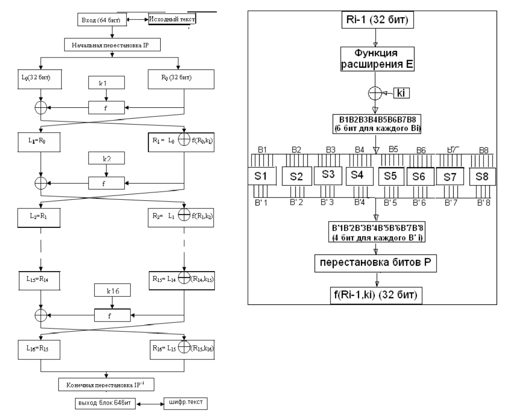
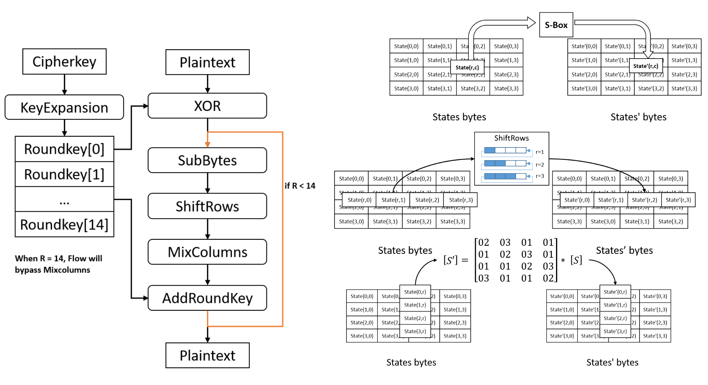
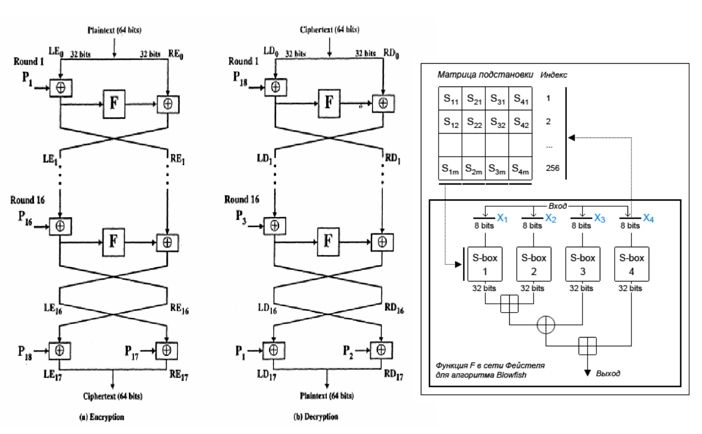
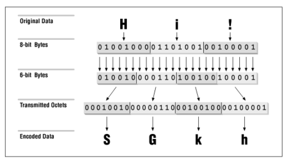

# Block Ciphers
## Описание проекта
Данный проект посвящён сравнительному анализу алгоритмов блочного симметричного шифрования:
- **DES** (Data Encryption Standard)
- **AES** (Advanced Encryption Standard)
- **Blowfish**
- **EB64** (Enhanced Base64) — алгоритм кодирования, исследованный в рамках проекта как быстрый метод преобразования данных.

**Цель работы** — реализовать алгоритмы блочного симметричного шифрования и оценить производительность, энергоэффективность и устойчивость к ошибкам в различных режимах работы.

## Описание алгоритмов шифрования

### DES (Data Encryption Standard)

  

 
 Схема алгоритма DES

#### Основные параметры
- Размер блока 64 бита
- Размер ключа 56 бита
- 16 раундов в цепи Фейстеля
- Каждый раунд: расширение + подстановка + перестановка + XOR(k)
- Раундовые ключи получаются из 56-битового ключа, посредством сдвига битов в каждом раунде
- Считается устаревшим, так как длины ключа в 56 бит недостаточно для обеспечения современной безопасности

### AES (Advanced Encryption Standard)

  

 
 Схема алгоритма AES

#### Основные параметры
- Размер блока: 128 бит
- Размер ключа: 128, 192 или 256 бит
- Количество раундов: 10, 12 или 14 (в зависимости от размера ключа)
- Каждый раунд: нелинейная замена байтов (SubBytes), циклический сдвиг строк (ShiftRows), перемешивание столбцов (MixColumns) и наложение раундового ключа (AddRoundKey).
- Раундовые ключи генерируются из основного ключа через процедуру расширения ключа
- Включает преобразования: ротация байтов, замена через S-блок, наложение констант раунда

### Blowfish

  

 
 Схема алгоритма Blowfish

#### Основные параметры
- Размер блока – 8 байт
- Количество раундов шифрования – 16
- Размер пользовательского ключа – целое число байт от 4 до 56
- При шифровании и расшифровании используется 18 32-битовых подключей и 4 32-битовых блока подстановок, каждый из которых содержит 256 элементов

### EB64 (Enhanced Base 64)

  

 
 Схема алгоритма EB64

#### Основные параметры
- Кодирование: Блочное кодирование с переменным размером блока
- Размер алфавита: 64 символа (расширенный набор Base64)
- Дополнительные возможности: Поддержка контрольных сумм и сжатия данных
- Процесс кодирования: Разбиение на блоки → преобразование в битовый поток → кодирование по 6 бит → добавление контрольной суммы
- Особенности: Автоматическое обнаружение ошибок передачи, оптимизация для текстовых данных

## Режимы работы
Исследовались следующие режимы:
- ECB (Electronic Codebook)
- CBC (Cipher Block Chaining)
- PCBC (Propagating Cipher Block Chaining)
- CFB (Cipher Feedback)
- OFB (Output Feedback)
- CTR (Counter Mode)

## Критерии сравнения
1. **Быстродействие** — время шифрования/расшифрования в зависимости от длины сообщения.
2. **Энергоэффективность** — потребление энергии при выполнении операций.
3. **Устойчивость к ошибкам** — влияние ошибок в шифротексте на расшифрованные данные.

## Методология тестирования

- Длина шифруемого сообщения варьируется от 1600 до 16000 байт (с шагом 1600 байт) 
- При каждой длине проводятся по 1000 экспериментов для каждого алгоритма
шифрования и при каждом из 6 режимов
- В рамках отдельного эксперимента шифруемые сообщения и ключи генерируются
случайно
- Результаты каждой серии экспериментов усредняются, вычисляются
среднеквадратические отклонения
API генерирует 12 текстовых файлов:
(3 вариации AES + DES + Blowfish + EB64) * (шифрование/расшифрование)
- Отдельный скрипт на Python экспортирует текстовые файлы и строит графики

## Результаты
### Быстродействие
- **AES** показал наилучшую производительность среди криптостойких алгоритмов.
- **Blowfish** демонстрирует высокую скорость при длинных ключах.
- **EB64** — самый быстрый, но не является криптографическим алгоритмом.
- **DES** — самый медленный из-за устаревшей структуры.

### Энергоэффективность
- **AES** и **Blowfish** показывают схожее энергопотребление.
- **DES** требует больше энергии на один блок данных.
- **EB64** — наиболее энергоэффективный.

### Устойчивость к ошибкам
- Режимы **CBC**, **PCBC**, **CFB** демонстрируют хорошую устойчивость.
- **ECB** — наименее устойчив, сохраняет статистические особенности открытого текста.
- **EB64** — ошибки в закодированных данных напрямую влияют на декодированный результат.
